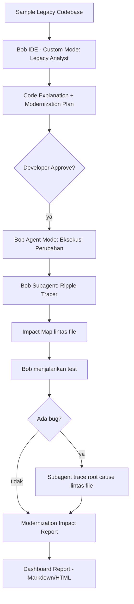

# 2. Arsitektur — LegacyLens

## 2.1 Filosofi Arsitektur
LegacyLens **bukan** aplikasi backend yang memanggil Bob lewat API. Bob IDE **adalah** mesin eksekusinya — semua analisis, keputusan, dan eksekusi kode dijalankan langsung di dalam Bob lewat custom mode & subagent. Bagian "produk" yang kita bangun sendiri hanyalah:
1. Sample codebase target (bahan demo)
2. Konfigurasi Bob (custom modes, subagents, skill) — lihat `4_BOB_CONFIG.md`
3. Dashboard ringan untuk menampilkan output report Bob secara rapi (opsional, murni presentasi)

## 2.2 Komponen Utama

## 2.3 Dua Subagent Inti
| Subagent | Tugas | Mode akses |
|---|---|---|
| **Legacy Analyst** | Baca kode lama, jelaskan fungsi & risiko, susun rencana modernisasi | Read + Ask (tidak eksekusi langsung) |
| **Ripple Tracer** | Setelah perubahan diterapkan, telusuri seluruh file yang bergantung ke kode yang berubah, prediksi dampak, jalankan test, trace root cause bug | Read + Execute (agent mode penuh) |

Pemisahan dua subagent ini penting untuk ditunjukkan ke juri — sesuai anjuran hackathon untuk manfaatin fitur **subagents** (isolated context per tugas), bukan satu mode besar yang mengerjakan semuanya.

## 2.4 Tech Stack
| Layer | Teknologi | Catatan |
|---|---|---|
| AI Engine / Core | **IBM Bob IDE 2.0** | Agent mode, subagents, custom modes, document understanding |
| Sample project | Node.js/Express (lihat `5_SAMPLE_CODEBASE.md`) | Codebase demo dengan legacy pattern & dependency lama |
| Report format | Markdown → dirender HTML | Output dari Bob disimpan sebagai file `.md` terstruktur |
| Dashboard (opsional) | Next.js + Tailwind, statis | Hanya menampilkan report, tidak ada backend API |
| Version control | Git/GitHub | Termasuk folder wajib `bob_sessions/` |

## 2.5 Alur Data
1. Developer buka Bob IDE di root sample codebase.
2. Jalankan `/init` agar Bob generate `AGENTS.md` — konteks persisten proyek.
3. Aktifkan custom mode **Legacy Analyst**, jalankan prompt Fase 1 (lihat `3_PROMPTS.md`).
4. Review hasil analisis, approve rencana modernisasi.
5. Bob (agent mode) eksekusi perubahan kode.
6. Otomatis lanjut ke custom mode **Ripple Tracer**, jalankan prompt Fase 2.
7. Bob hasilkan `impact_report.md` — disalin/diimpor ke dashboard untuk presentasi.

## 2.6 Kenapa Tidak Ada Backend/API Custom
Karena syarat hackathon menegaskan Bob IDE harus jadi **core component**, kita sengaja tidak membangun API/backend terpisah yang "membungkus" Bob — itu justru mengurangi keterlihatan peran Bob di solusi. Semua logika inti (analisis, keputusan risiko, eksekusi) terjadi di dalam Bob itu sendiri.